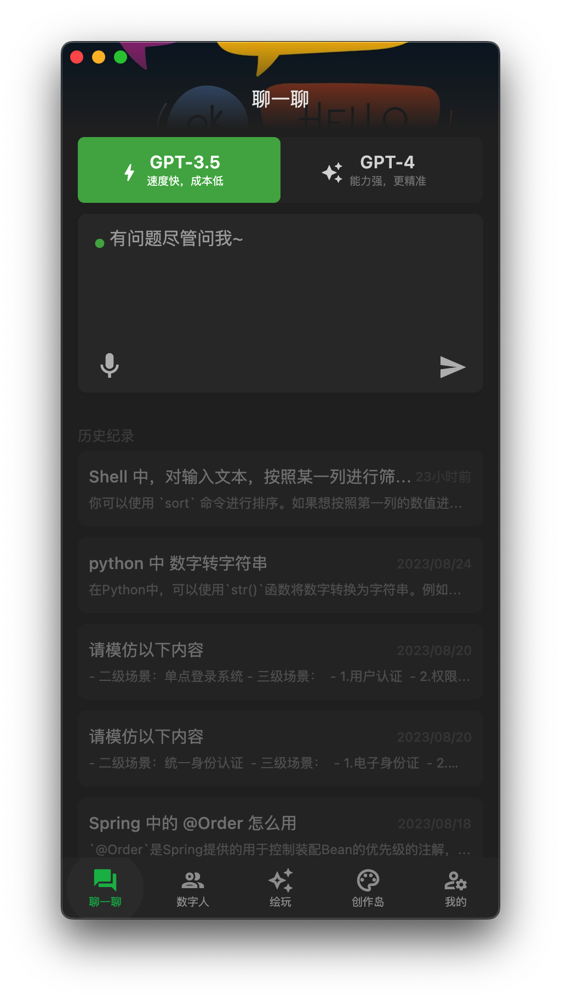
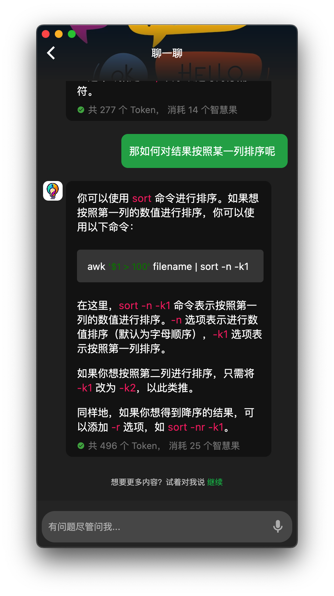
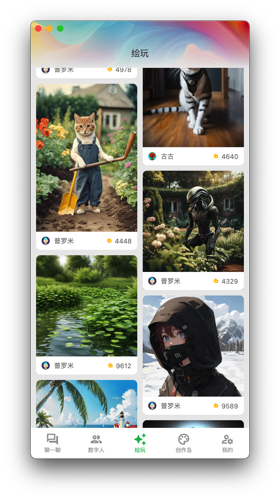
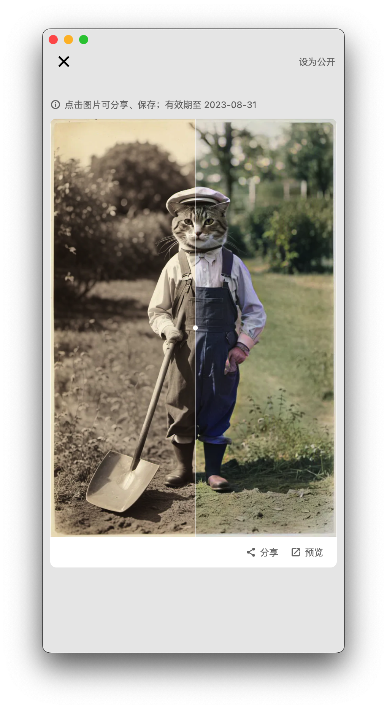
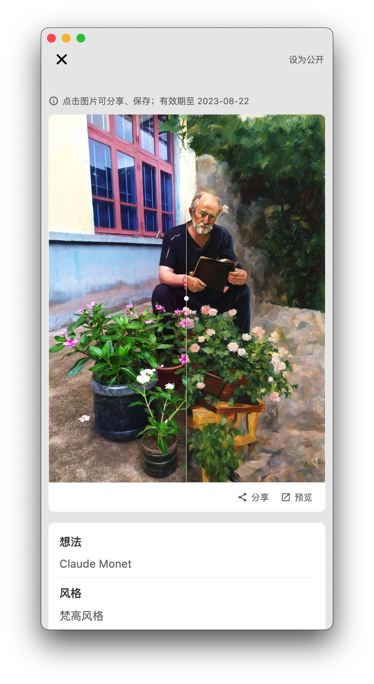
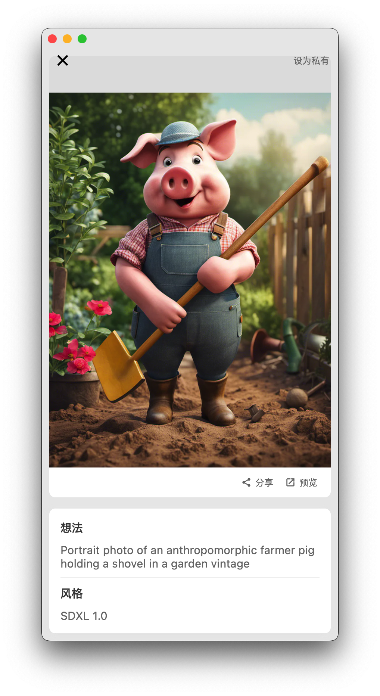
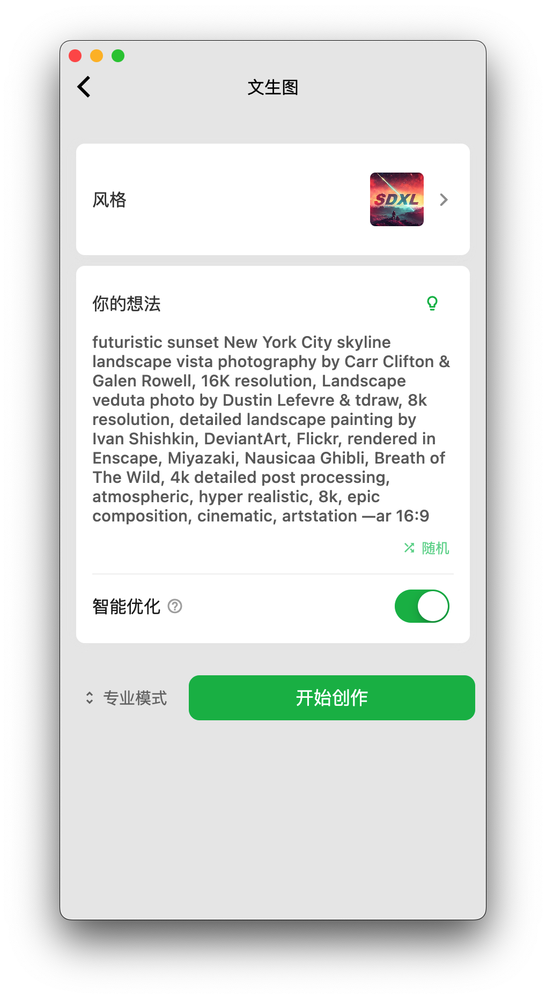

# AIdea - AI 聊天、协作、图像生成

一款集成了主流大语言模型以及绘图模型的 APP， 采用 Flutter 开发，代码完全开源，支持以下功能：

- 支持 GPT-3.5/4 问答聊天
- 支持国产模型：通义千问，文心一言
- 支持文生图、图生图、超分辨率、黑白图片上色等功能，集成 Stable Diffusion 模型，支持 SDXL 1.0

开源代码：

- 客户端：https://github.com/mylxsw/aidea
- 服务端：https://github.com/mylxsw/aidea-server （即将开放）

微信技术交流群：

电报群：[点此加入](https://t.me/aideachat)

## 下载安装地址

Android/IOS APP：https://aidea.aicode.cc/

> IOS 国区目前不可用，除此之外所有区域都可以下载。

Mac 桌面端：https://github.com/mylxsw/aidea/releases

Web 端：https://web.aicode.cc/

## APP 截图

  | 
:-------------------------:|:-------------------------:
  |  
  |  
  |  
  | 

## Star History

<a href="https://star-history.com/#mylxsw/aidea&Date">
  <picture>
    <source media="(prefers-color-scheme: dark)" srcset="https://api.star-history.com/svg?repos=mylxsw/aidea&type=Date&theme=dark" />
    <source media="(prefers-color-scheme: light)" srcset="https://api.star-history.com/svg?repos=mylxsw/aidea&type=Date" />
    
  </picture>
</a>

## License

MIT

Copyright (c) 2023, mylxsw

