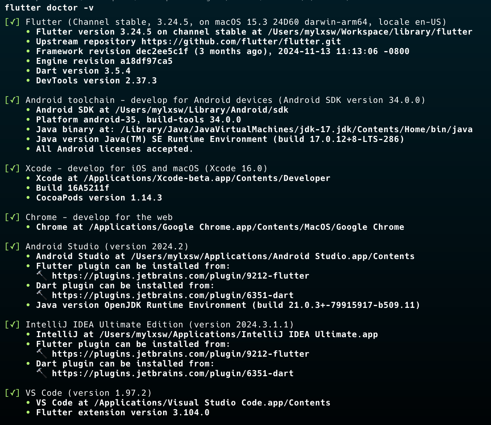
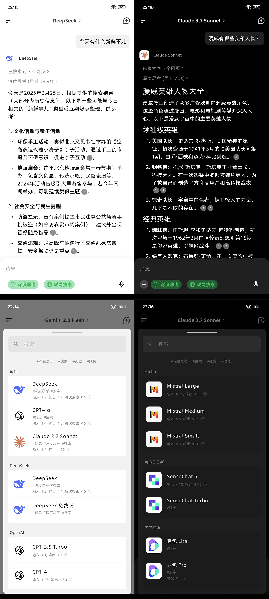
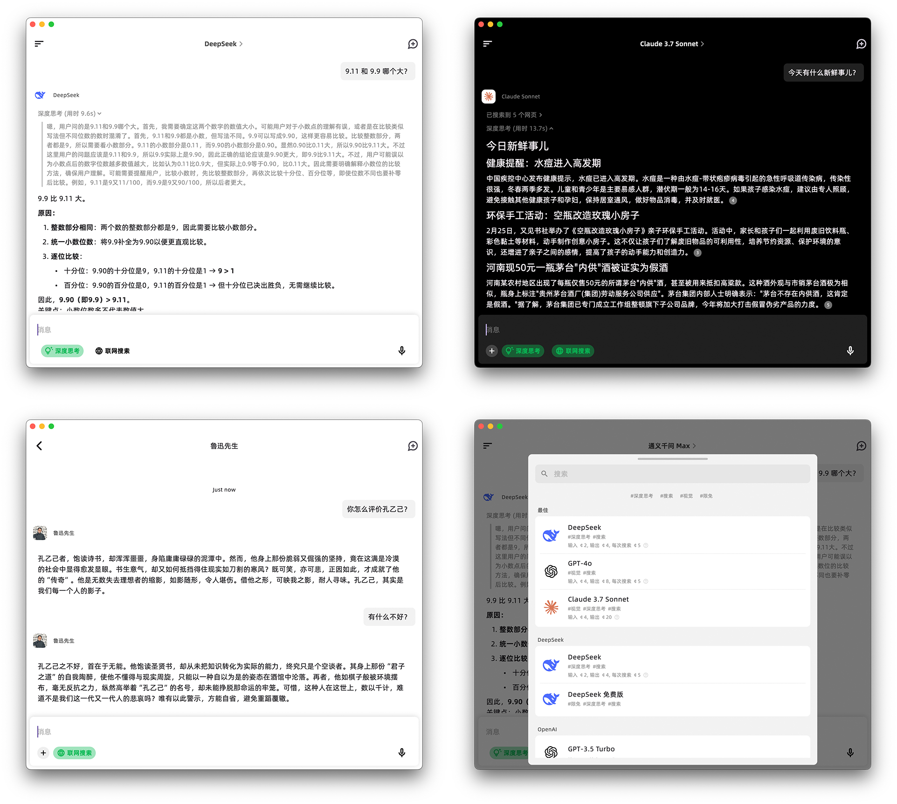
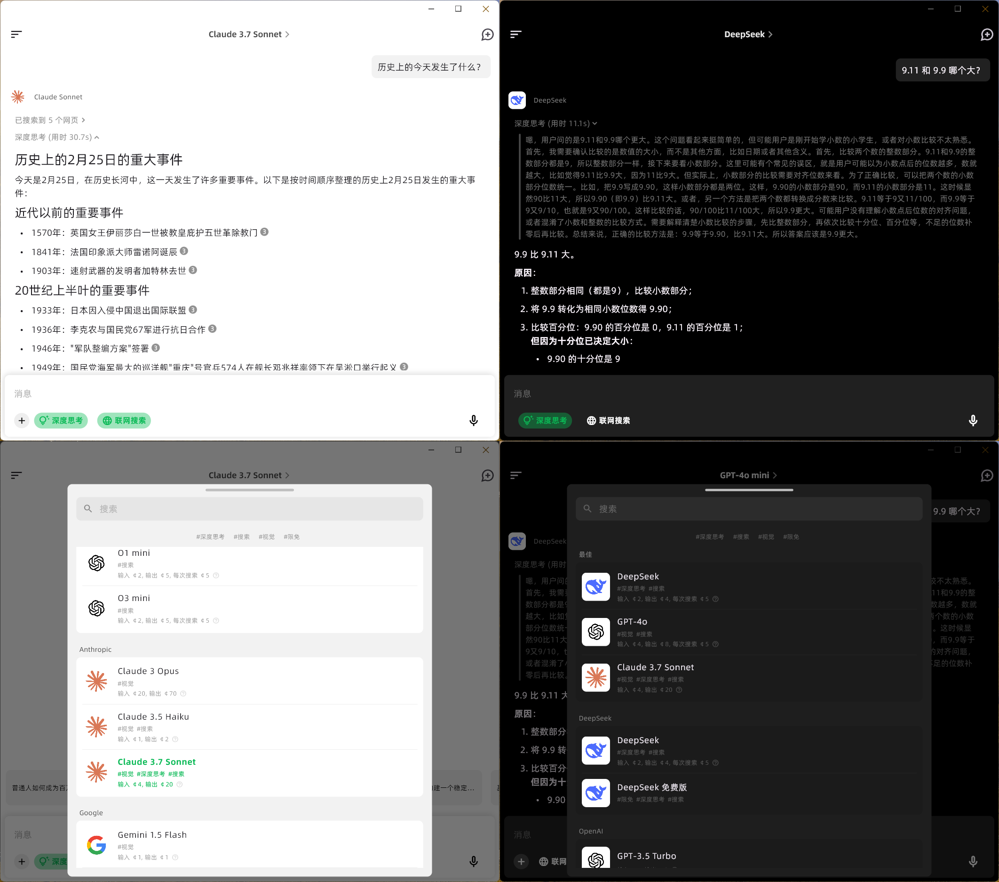

# AIdea - AI 聊天、协作、图像生成

[](https://app.fossa.com/projects/custom%2B39727%2Fgithub.com%2Fmylxsw%2Faidea?ref=badge_shield)


<a href="https://trendshift.io/repositories/1013" target="_blank"></a>

一款集成了主流大语言模型以及绘图模型的 APP， 采用 Flutter 开发，代码完全开源。

下载体验地址：

https://aidea.aicode.cc

开源代码：

- 客户端：https://github.com/mylxsw/aidea
- 服务端：https://github.com/mylxsw/aidea-server
- Docker 部署：https://github.com/mylxsw/aidea-docker

## 开发、编译运行环境

默认分支 `main` 是 v2 版本，当前正在开发中，如需自己部署，请切换到 [v1.x](https://github.com/mylxsw/aidea/tree/v1.x) 分支。

```bash
git checkout v1.x
```

搭建开发环境，用来编译和打包 APP，可以参考下面的文章，更多文章后面有时间了会持续更新。

- [AIdea 项目开发环境部署教程（一）前端 Flutter 环境搭建](https://mp.weixin.qq.com/s/bgAIH6s7t5IREusK_WtpRg)
- [AIdea 项目开发环境部署教程（二）服务端 Golang 环境搭建](https://mp.weixin.qq.com/s?__biz=MzA3NTU1NDk4Mg==&mid=2454663711&idx=1&sn=c2c66abc20f8e0900afe645ff1f552ac&chksm=88d55bd6bfa2d2c063ea15a4e8864c197009b49233c710b85725f1aa946836e15a26439c69a7&scene=178&cur_album_id=3204997940193296389#rd)
- [AIdea 项目开发环境部署教程（三）Windows 编译环境搭建](https://mp.weixin.qq.com/s?__biz=MzA3NTU1NDk4Mg==&mid=2454663731&idx=1&sn=2aa4841daeb8dc4132e8abe63f585996&chksm=88d55bfabfa2d2ecce8224dcf23da6f911d3d8324121d141fd5c0324197c6f4845dd63639ac2&scene=178&cur_album_id=3204997940193296389#rd)
- [Flutter 应用 Windows 安装包创建教程](https://mp.weixin.qq.com/s?__biz=MzA3NTU1NDk4Mg==&mid=2454663689&idx=1&sn=73c93edd9ddacb2d4c36061cc79be059&chksm=88d55bc0bfa2d2d6ecaa7979835431467105d9572953f1e96c0f735df3fe60d4f6d6137f041d&scene=178&cur_album_id=3204997940193296389#rd)

> 有些小伙伴在编译的时候总是失败，非常令人抓狂，这并不是什么问题，而是 Flutter 特有的特性，随着 Flutter 版本的变化，编译失败是常态。
> 保险起见，你可以参考我的本地环境配置：
>
> 

## 私有化部署

如果你不想使用托管的云服务，可以自己部署服务端，[部署请看这里](https://github.com/mylxsw/aidea-server/blob/main/docs/deploy.md)。

不想自己折腾，可以找我来帮你部署，详情参考 [服务器代部署说明](https://github.com/mylxsw/aidea-server/blob/main/docs/deploy-vip.md)。

## 技术交流

- 微信技术交流群：请添加微信号 `x-prometheus` 为好友，拉你进群。
- 微信公众号

    

## 产品截图

移动端



MacOS 端



Windows 端



## License

MIT

Copyright (c) 2025, mylxsw
